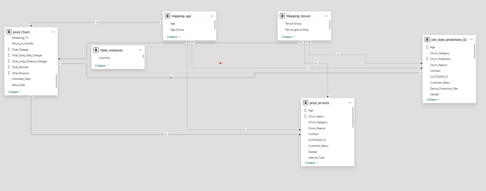

# 🚀 Churn Prediction

A modern analytics project using SQL Server, Power BI, and Python to uncover insights in customer data, visualize retention patterns, and predict which users are likely to leave—all in one place.

---

## Overview

- **Data Preparation:** Imported and cleaned customer data in SQL Server, staged for analytics, and built key views for analysis.
- **Data Exploration:** Profiled users and revenue, segmented customer attributes, and handled missing values using SQL and Power Query.
- **Dashboards:** Built interactive Power BI reports on customer segments, account activity, service usage, and business trends.
- **Predictive Modeling:** Applied a Random Forest model in Python to forecast customer churn, achieving high accuracy and highlighting key factors.

---

## Highlights

- Complete data pipeline from ingestion to prediction
- Visual, actionable retention insights with dashboards
- Machine learning integration for smarter decisions

## 🔍 Insights Gained

**SQL Server** allowed me to efficiently organize, cleanse, and version large sets of customer data, forming a strong foundation for analysis.

**Power BI** transformed the processed data into dynamic dashboards, making it easy to visualize trends and uncover business insights.

**Machine Learning** brought predictive power to the project, enabling data-driven forecasts that support smarter retention strategies.
